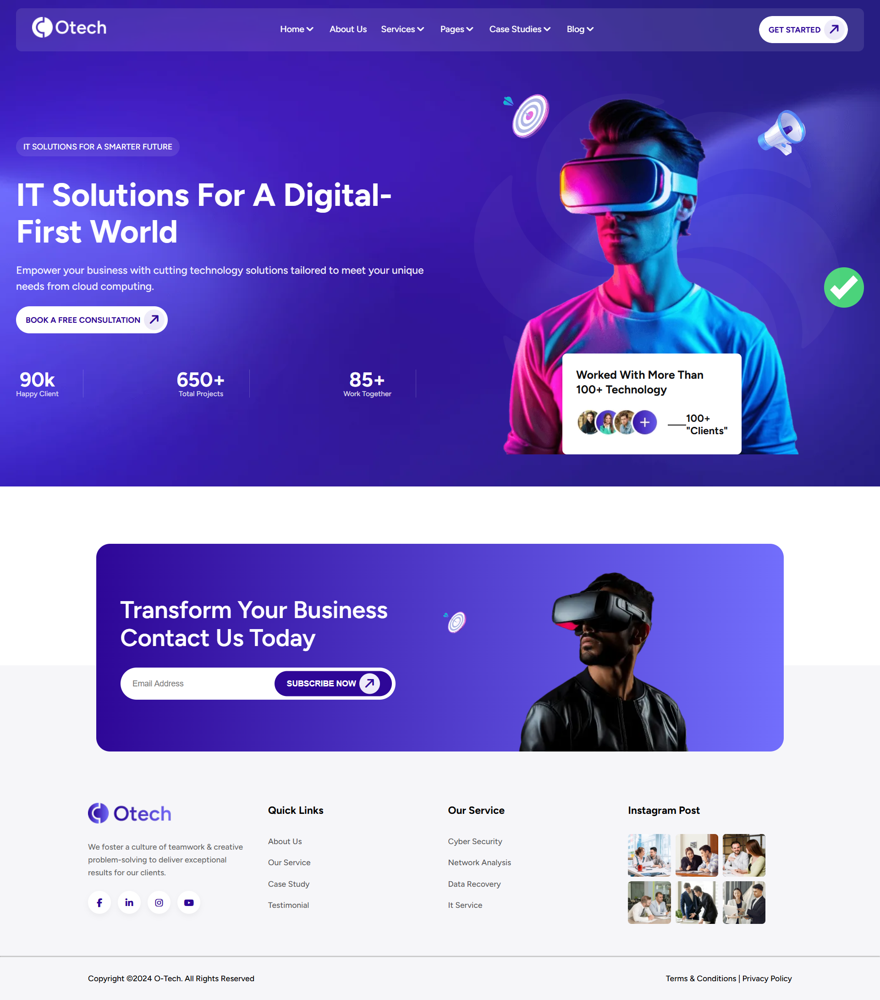
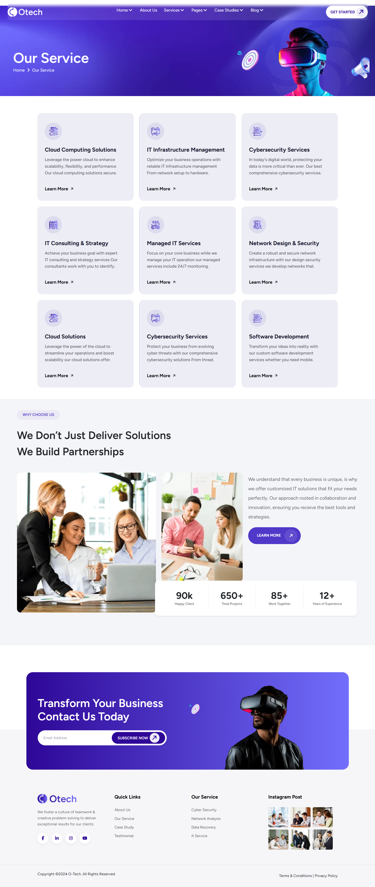
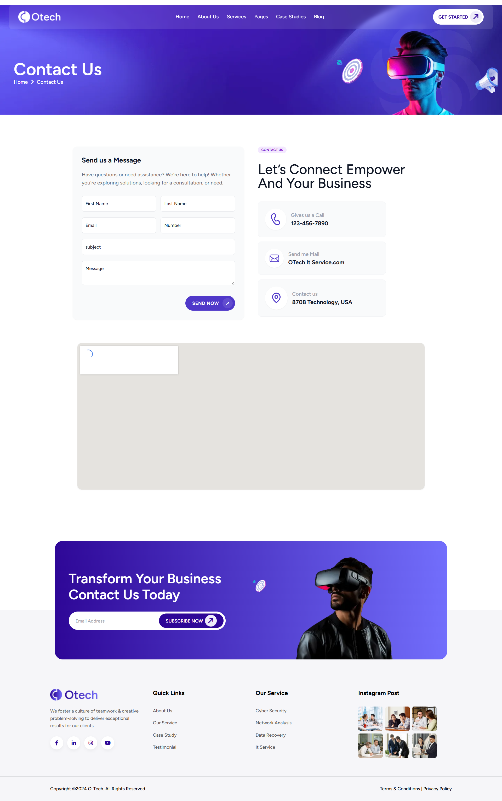

# Otech — IT Solutions Website

A pixel-accurate recreation of the [Otech](https://html.vikinglab.agency/otech/) website template, built as a practical assessment for the Xolva Trainee Software Engineer Program under the mentorship of **Ashir Azeem**.

The task required applying HTML, CSS, Bootstrap, and Tailwind CSS across four separate pages — each with a different technology constraint — while maintaining clean code, a proper folder structure, and full responsiveness.

## Overview

### The Challenge

Reproduce a four-page IT solutions website from a provided live reference design. Each page had a mandatory technology requirement:

| Page | Technology Requirement |
|------|----------------------|
| Home | HTML & CSS primary — Bootstrap components allowed (carousels, accordions, etc.) |
| About Us | Tailwind CSS |
| Services | Bootstrap |
| Contact Us | Tailwind CSS |

Additional requirements from the brief:

- Keep the design as close to the reference as possible
- Maintain clean and organised code with a proper folder structure
- Ensure responsiveness across devices
- Push code regularly to GitHub after each major update

### Reference Design

- **Home:** https://html.vikinglab.agency/otech/
- **About Us:** https://html.vikinglab.agency/otech/about.html
- **Services:** https://html.vikinglab.agency/otech/service.html
- **Contact Us:** https://html.vikinglab.agency/otech/contact.html

### Screenshot

- **Home Page:**


- **About Us:**


- **Services:**


- **Contact Us:**


### Links

- **Live Site:** [https://moinuddin2003.github.io/Landing-Page/](https://moinuddin2003.github.io/Landing-Page/)
- **Repository:** [https://github.com/moinuddin2003/Landing-Page](https://github.com/moinuddin2003/Landing-Page)

---

## My Process

### Built With

- Semantic HTML5 markup
- Custom CSS (`styles.css`) — homepage primary styling
- Tailwind CSS (via CDN) — About Us & Contact Us pages, plus team section on homepage
- Bootstrap 5 — Services page & homepage services grid
- JavaScript — carousel and slider initialisation (`slider-init.js`)
- [Owl Carousel 2](https://owlcarousel2.github.io/OwlCarousel2/) — team & case study sliders
- [Slick Carousel](https://kenwheeler.github.io/slick/) — testimonial slider
- Google Fonts — Figtree, Inter, Montserrat
- Font Awesome 7 — iconography throughout

### Folder Structure

```
Landing-Page/
├── assets/             # All images, SVGs, and icon files
├── index.html          # Home page (HTML + CSS + Bootstrap)
├── about.html          # About Us page (Tailwind CSS)
├── service.html        # Services page (Bootstrap)
├── contact.html        # Contact Us page (Tailwind CSS)
├── styles.css          # Custom stylesheet (homepage)
├── output.css          # Tailwind compiled output
├── tailwind.config.js  # Tailwind configuration
├── slider-init.js      # Carousel & slider initialisation
├── package.json
└── package-lock.json
```

### Pages & Sections

#### Home (`index.html`) — HTML & CSS + Bootstrap

- **Navbar** — logo, navigation links, and "Get Started" CTA
- **Hero** — headline, statistics (90k clients, 650+ projects, 85+ partners), and a layered image composition with decorative SVG shapes
- **Why Choose Us** — two-column layout with stacked images and a 12+ years experience badge
- **Our Services** — Bootstrap responsive grid of six service cards (Cloud Computing, Infrastructure, Cybersecurity, IT Consulting, Managed IT, Network Design)
- **Case Studies** — image cards with hover read-more overlays in a Slick slider
- **Testimonials** — five-star quote cards in an Owl Carousel with custom navigation buttons
- **Pricing** — three-tier cards (Basic $49 / Classic $65 / Normal $89) with a featured variant
- **Blog** — two editorial preview cards with date, author metadata, and read-more CTAs
- **Team** — Owl Carousel cards with a social overlay that slides in on hover
- **CTA Banner** — email subscription strip with inline form
- **Footer** — four-column layout: brand, quick links, services, and contact details

#### About Us (`about.html`) — Tailwind CSS

Rebuilt using Tailwind utility classes, matching the reference layout for the company story, values, and team overview sections.

#### Services (`service.html`) — Bootstrap

Full services detail page using Bootstrap's grid, card, and accordion components to match the reference layout.

#### Contact Us (`contact.html`) — Tailwind CSS

Contact form, office location, and support details, styled entirely with Tailwind utility classes.

### Key Implementation Details

**Per-page technology constraints**  
Each page intentionally uses a different styling approach as required by the brief. The homepage keeps Tailwind isolated to the team section only, preventing utility class conflicts with the hand-written `styles.css` that drives the rest of the page.

**Hybrid Tailwind + custom CSS**  
Rather than running a full PostCSS build for every section, Tailwind is loaded via CDN and scoped to specific sections. The `tailwind.config.js` and `output.css` in the repo lay the groundwork for migrating to a proper build pipeline in a future iteration.

**Carousel initialisation (`slider-init.js`)**  
All three interactive carousels are wired up in a single file. Custom prev/next buttons external to the carousel containers are linked via jQuery's `slickPrev`/`slickNext` API (Slick) and Owl's `prev.owl.carousel`/`next.owl.carousel` custom events. This keeps the HTML clean and the JS logic centralised.

**Team card hover interaction**  
The social link bar sits at `translate-y-full` (fully off-screen below the card) by default and transitions into view on `:hover` with a CSS `transform` — no JavaScript needed. A simultaneous `scale(1.04)` on the photo adds depth.

**Pricing featured variant**  
The "Classic Plan" middle card applies a single `.pricingFeatured` modifier class. All three cards share identical markup; the visual difference (background, button colour inversion) comes entirely from that one additional class.

### What I Learned

Working across four pages with four different technology requirements in the same project taught me to think carefully about where each tool is strongest. Bootstrap's grid made the services layout fast and consistent; Tailwind gave granular control on the contact and about pages without writing custom class names; and raw CSS remained the most readable choice for complex, one-off sections like the hero.

I also got practical experience managing multiple carousel libraries on the same page — specifically that Owl Carousel requires its container to be in the DOM and visible before initialisation, and that Slick and Owl use different event naming conventions for external navigation controls.


## Acknowledgments

This project was assigned and reviewed by **Ashir Azeem** as part of the Xolva Trainee Software Engineer Program. The reference design is the [Otech HTML template](https://html.vikinglab.agency/otech/) by Viking Lab.

## Author

- **GitHub:** [@moinuddin2003](https://github.com/moinuddin2003)
- **Organisation:** [Xolva](https://xolva.com) — Trainee Software Engineer
